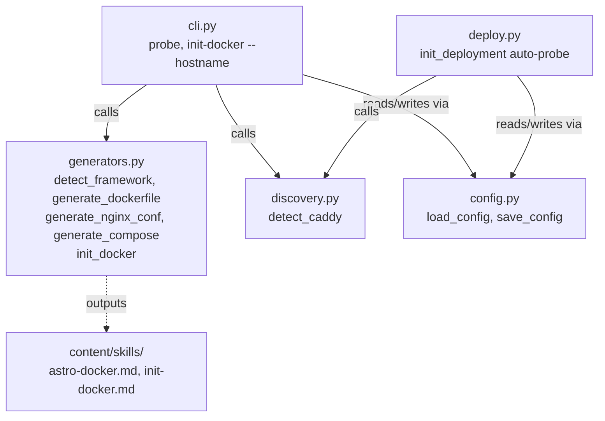

# Architecture Update — Sprint 006: Astro Support and Caddy Probe

## What Changed

### generators.py — Astro framework support

`detect_framework()` gains an Astro branch: when `package.json` includes
`"astro"` in dependencies, it returns
`{language: "node", framework: "astro", entry_point: "nginx"}`. This is
inserted after the Express check and before the generic Node fallback so
detection precedence is correct.

A new module-level constant `_DOCKERFILE_ASTRO` provides a 3-stage build:

- **deps** (`node:20-alpine`): install npm dependencies
- **build** (`node:20-alpine`): copy source, run `npm run build` to produce `dist/`
- **runtime** (`nginx:alpine`): copy `dist/` from build stage, copy
  `docker/nginx.conf`, expose port 8080

A new function `generate_nginx_conf() -> str` returns a minimal production
nginx config: listen on port 8080 (non-root), `try_files` for SPA routing,
gzip, year-long cache on hashed assets, no-cache on `index.html`, basic
security headers (X-Frame-Options, X-Content-Type-Options).

`generate_dockerfile()` gains an Astro branch before existing Node handling:
when `fw == "astro"`, return `_DOCKERFILE_ASTRO`.

`generate_compose()` and `generate_env_example()` replace the two-way port
selection (`"3000" if lang == "node" else "8000"`) with a three-way:

- `astro` framework: port 8080
- `node` language: port 3000
- other: port 8000

`generate_env_example()` also omits `NODE_ENV` for Astro (nginx does not use it).

`init_docker()` gains a post-Dockerfile step: if framework is Astro, write
`docker/nginx.conf` and append the path to the generated files list.

### discovery.py — Caddy detection

A new function `detect_caddy(context: str) -> dict` queries a remote Docker
host for a running Caddy container:

```
docker --context <context> ps --filter name=caddy --format {{.Names}}
```

Returns `{running: bool, container: str | None}`. The `context` parameter is
required; this function is remote-only. It uses the existing `_run_command()`
helper. `discover_system()` is not modified (it reflects local capabilities).

### cli.py — probe subcommand and init-docker hostname flag

New `rundbat probe <name>` subcommand:

1. Loads `rundbat.yaml`, finds the named deployment.
2. Reads `docker_context` from the deployment entry.
3. Calls `detect_caddy(context)`.
4. Saves `reverse_proxy: caddy` or `reverse_proxy: none` to the deployment
   entry in `rundbat.yaml` via `config.save_config()`.
5. Prints the result; supports `--json`.

`cmd_init_docker()` gains a `--hostname` CLI argument on the `init-docker`
subparser. After loading deployments, if any deployment has
`reverse_proxy: caddy` and no hostname is provided, the CLI prints:

```
Caddy detected on deployment '<name>' — pass --hostname to include reverse proxy labels
```

When `--hostname` is provided, it overrides the hostname read from deployment
config and flows into `init_docker()` as before.

### deploy.py — auto-probe during deploy-init

`init_deployment()` gains a step after remote platform detection: it calls
`detect_caddy(ctx)` and appends `reverse_proxy: caddy` or `reverse_proxy: none`
to the deployment entry before saving to `rundbat.yaml`. No user interaction
is required.

### content/skills/ — new and updated skill files

`astro-docker.md` (new): when-to-use triggers, prerequisites, step-by-step
guide for running `init-docker` on an Astro project including nginx.conf
review, Caddy/hostname guidance referencing the probe command, and local test
instructions.

`init-docker.md` (updated): adds a note explaining that if
`reverse_proxy: caddy` appears in any deployment, the user should pass
`--hostname` to include Caddy labels.

## Why

Astro static sites are a common frontend choice. The existing Node Dockerfile
produces a running Node process, which is inappropriate for static sites.
Production serving via nginx is faster, smaller, and idiomatic for static
content. A dedicated `_DOCKERFILE_ASTRO` template avoids conditional
complexity in `_DOCKERFILE_NODE`.

Caddy label generation already existed in `generate_compose()` but was gated
on `hostname` being present in `rundbat.yaml`. In practice `init-docker` runs
before `deploy-init`, so labels were never generated automatically. The probe
pattern makes proxy detection explicit and persistent: probe once (or
auto-probe during deploy-init), rely on the stored `reverse_proxy` field
thereafter.

## Impact on Existing Components

| Component | Change |
|---|---|
| `generators.py` | Astro detection, template, nginx conf, port logic, init_docker wiring |
| `discovery.py` | New `detect_caddy(context)` function |
| `cli.py` | New `probe` subcommand; `--hostname` flag on `init-docker` |
| `deploy.py` | Auto-probe in `init_deployment()` |
| `content/skills/astro-docker.md` | New file |
| `content/skills/init-docker.md` | Updated with Caddy guidance |
| `config.py` | No change |
| `installer.py` | No change (auto-discovers skill files) |

## Migration Concerns

Existing deployments in `rundbat.yaml` will not have a `reverse_proxy` field.
`cmd_init_docker` handles its absence gracefully — no warning, no error. No
migration step needed.

Port 8080 applies only to Astro. Existing Node projects continue to use port
3000. No existing compose files are affected.

`detect_caddy` requires a valid Docker context pointing to a reachable remote
host. An unreachable host returns `{running: False, container: None}` via
`_run_command` error handling; no exception propagates to the caller.

## Module Diagram



## Data Model Change

New optional field on deployment entries in `rundbat.yaml`:

```yaml
deployments:
  prod:
    docker_context: docker1.apps1.example.com
    host: ssh://root@docker1.apps1.example.com
    build_strategy: context
    platform: linux/amd64
    reverse_proxy: caddy        # NEW — written by probe or deploy-init
    hostname: myapp.example.com # existing, optional
```

The field is optional and defaults to absent. No schema migration required.

## Design Rationale

**Why `reverse_proxy` is persisted rather than detected live at init-docker time**

`init-docker` runs on the local machine, which may not have SSH access or a
Docker context configured at the moment it is called (it often precedes
`deploy-init`). Live detection would create a hard ordering dependency. The
probe pattern makes detection explicit, one-time, and persistent.
`init-docker` reads the stored value — no network access required. Auto-probe
in `deploy-init` covers the zero-friction common path.

Consequence: stale config is possible if the remote changes. Users can re-run
`rundbat probe <name>` at any time to refresh.

**Why `detect_caddy` requires a context argument**

Local Docker hosts are not expected to run Caddy as a reverse proxy. Requiring
a context keeps the function scope narrow, forces callers to be explicit about
which host they are probing, and avoids false positives on developer machines.

## Open Questions

None. All design decisions are resolved.
