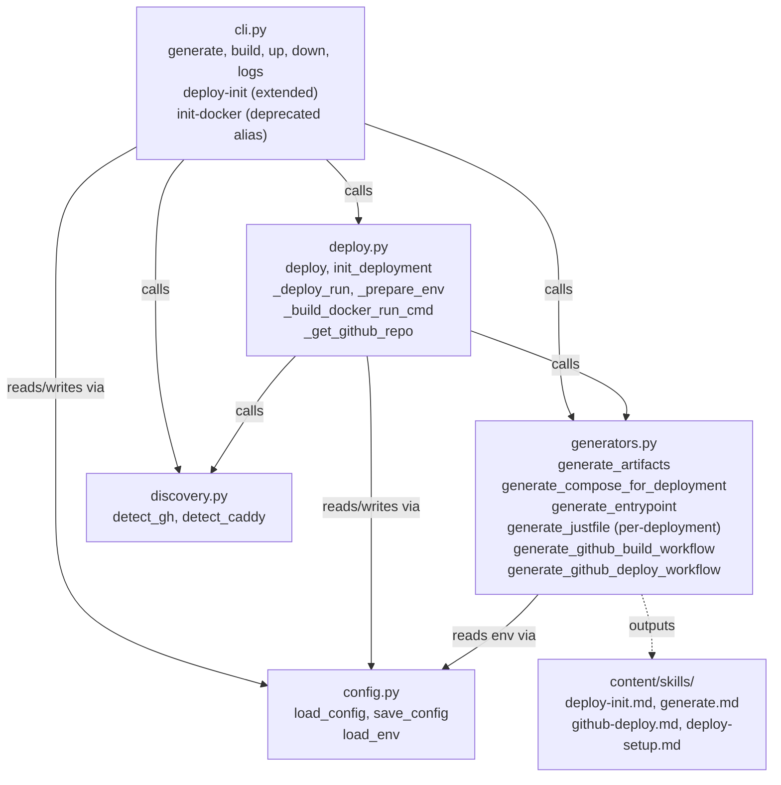
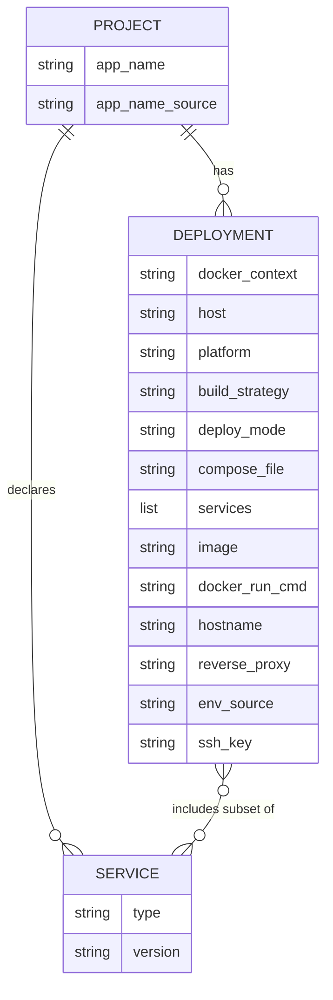

# Architecture Update — Sprint 007: Docker Lifecycle and Deployment Initialization

## What Changed

### generators.py — per-deployment artifact generation

The existing `generate_compose()` generates a single generic compose file. This sprint replaces it with a per-deployment generation model.

**New function `generate_compose_for_deployment(app_name, framework, deployment_name, deployment_cfg, all_services)`**: Produces a `docker-compose.<name>.yml` for one deployment. The deployment config drives:
- Which services are included (via `deployment_cfg["services"]`)
- Whether to use `build:` (strategy is context or ssh-transfer) or `image:` (strategy is github-actions)
- Which env_file to reference (`docker/.<name>.env`)
- Whether to include Caddy labels (`hostname` + `reverse_proxy: caddy`)
- Port selection (from framework detection: 8080 astro, 3000 node, 8000 python)

**New function `generate_entrypoint(framework)`**: Returns a framework-aware `entrypoint.sh` shell script that handles SOPS/age key setup before `exec`-ing the server command. Variants: node (`npm start`), python-gunicorn, python-uvicorn, nginx (no-op passthrough for Astro).

**Updated `generate_justfile(app_name, deployments, all_services)`**: Replaces the ENV-variable-based single-Justfile approach with explicit per-deployment named recipes:
- `<name>_up`, `<name>_down`, `<name>_logs`, `<name>_build` for compose-mode deployments
- Remote deployments prefix with `DOCKER_CONTEXT=<ctx>`
- github-actions deployments use `docker compose pull` in `<name>_up`
- run-mode deployments emit `docker pull && docker stop && docker rm && docker run` in `<name>_up`
- Database recipes (`<name>_psql`, `<name>_db_dump`) generated for deployments that include postgres

**New function `generate_github_build_workflow(platform)`**: Generates `.github/workflows/build.yml`. Triggers: `push` to main, `workflow_dispatch`. Builds image, pushes to GHCR. No deploy step.

**New function `generate_github_deploy_workflow(app_name, compose_file, deploy_mode, docker_run_cmd)`**: Generates `.github/workflows/deploy.yml`. Triggers: `workflow_run` (on build success) and `workflow_dispatch`. SSH step runs compose pull+up or docker pull+run depending on `deploy_mode`.

**Existing `generate_github_workflow()`**: Deprecated. Replaced by the two functions above. The old function remains for backward compatibility but new code goes through the split functions.

**Updated `init_docker()`** becomes **`generate_artifacts(project_dir, cfg)`**: High-level orchestrator that reads the full config dict and:
1. Calls `generate_compose_for_deployment()` for every deployment
2. Generates `docker/Dockerfile` (once)
3. Generates `docker/entrypoint.sh` (once)
4. Generates `docker/Justfile` (per-deployment)
5. Generates `docker/.*.env` for dotconfig deployments via `config.load_env()`
6. Generates `.github/workflows/build.yml` and `deploy.yml` when any deployment has `build_strategy: github-actions`
7. Updates `.gitignore` to include `docker/.*.env`
8. Returns list of generated file paths

`init_docker()` is preserved as a deprecated wrapper calling `generate_artifacts()`.

### cli.py — new subcommands and expanded deploy-init flags

**New subcommand `generate`**: Calls `generate_artifacts()`. Flags: `--json`, `--deployment <name>` (regenerate one deployment only).

**New subcommand `build <deployment>`**: Resolves deployment config. If `build_strategy: github-actions`, calls `detect_gh()` then `gh workflow run build.yml --repo <repo> --ref <branch>`. Otherwise runs `docker compose -f docker/docker-compose.<name>.yml build` with the correct `DOCKER_CONTEXT`.

**New subcommand `up <deployment>`**: Resolves deployment. For compose-mode, calls `docker compose ... up -d` (with `pull` first if github-actions strategy). For run-mode, executes pull + stop/rm + `docker_run_cmd` from config. Flag `--workflow` triggers deploy workflow via `gh workflow run` instead of direct docker commands.

**New subcommand `down <deployment>`**: Compose-mode: `docker compose ... down`. Run-mode: `docker stop <app_name> && docker rm <app_name>`.

**New subcommand `logs <deployment>`**: Compose-mode: `docker compose ... logs -f`. Run-mode: `docker logs -f <app_name>`.

**Updated `deploy-init` flags**: Adds `--deploy-mode` (choices: compose, run; default: compose) and `--image` (GHCR image reference, required when `deploy_mode: run` or `build_strategy: github-actions`).

**Updated `init`**: Next-steps message updated to reference `rundbat generate` instead of `rundbat init-docker`.

**`init-docker` subcommand**: Preserved as deprecated alias for `generate`.

### deploy.py — run mode, env injection, GitHub repo helper

**New function `_deploy_run(deployment_name, deploy_cfg, dry_run)`**: Handles `deploy_mode: run` deployments. Steps: call `_prepare_env()`, pull image via Docker context, stop/rm existing container, execute `docker_run_cmd` from config.

**New function `_prepare_env(deployment_name, docker_context, host, ssh_key)`**: Loads env from `config.load_env(deployment_name)`, writes to a temp file, SCPs to `/opt/<app_name>/.env` on the remote.

**New function `_build_docker_run_cmd(app_name, image, port, hostname, env_file, docker_context)`**: Assembles a `docker run` command string from known parameters. Includes Caddy labels when `hostname` is set. Returns the command string for storage in `rundbat.yaml`.

**New function `_get_github_repo()`**: Reads `git remote get-url origin`, parses GitHub SSH or HTTPS URL, returns `owner/repo` string.

**Updated `init_deployment()`**: Gains `--deploy-mode` and `--image` parameters. When `deploy_mode: run`, calls `_build_docker_run_cmd()` and saves `docker_run_cmd` to the deployment entry. When `build_strategy: github-actions`, generates workflow files via `generators.generate_github_build_workflow()` and `generate_github_deploy_workflow()`.

**Updated `deploy()` dispatch**: Checks `deploy_mode` before `build_strategy`. If `deploy_mode == "run"`, calls `_deploy_run()`. Otherwise uses existing strategy dispatch.

### discovery.py — GitHub CLI detection

**New function `detect_gh()`**: Runs `gh auth status` via `_run_command()`. Returns `{installed: bool, authenticated: bool}`. Used by `cmd_build` and `cmd_up --workflow` to gate gh CLI calls with a clear error message.

### rundbat.yaml schema — new deployment fields

New optional fields on each deployment entry:

| Field | Type | Default | Purpose |
|-------|------|---------|---------|
| `deploy_mode` | string | `compose` | `compose` or `run` |
| `services` | list[string] | all project services | Service names for this deployment |
| `image` | string | — | GHCR image ref (github-actions / run mode) |
| `docker_run_cmd` | string | — | Full docker run command (run mode only) |
| `env_source` | string | — | `dotconfig`, `file`, or `none` |

`build_strategy` and `deploy_mode` are orthogonal. Any combination is valid (e.g., `build_strategy: context` with `deploy_mode: run`).

### content/skills/ — new and updated skill files

`generate.md` (new): Trigger phrases for artifact generation, step-by-step guide for `rundbat generate`, explanation of per-deployment files.

`deploy-init.md` (new): Guided deployment initialization skill. 8-step interview with explicit `AskUserQuestion` specs covering target, services, deploy mode, SSH access, domain, build strategy, and env config. Summary table before writing config.

`github-deploy.md` (new): GitHub Actions CI/CD guide. Covers deploy-init with github-actions strategy, workflow secrets, `rundbat build` and `rundbat up --workflow` commands.

`deploy-setup.md` (updated): Simplified — references `deploy-init.md` for the guided path, retains SSH troubleshooting table.

## Why

The current `init-docker` → generic `docker-compose.yml` model breaks down when deployments have different service sets (e.g., prod is app-only via GHCR, local has postgres+redis). A single compose file cannot represent two deployments with different services, images, and contexts without environment-variable gymnastics. Per-deployment compose files make each target's configuration explicit and self-contained.

The ENV-variable Justfile approach (current) is cumbersome: users must remember to set `DEPLOY_ENV=prod` before running `just build`. Named recipes (`just prod_build`) are more discoverable and error-resistant.

The monolithic GitHub Actions workflow (build + deploy in one job) prevents on-demand builds without re-deploying and prevents re-deploying without rebuilding. Splitting into `build.yml` and `deploy.yml` gives each step independent trigger control.

The `deploy_mode: run` path is needed for simple single-container deployments where a compose file is overhead. `docker_run_cmd` stored in config is visible and auditable.

dotconfig env injection is needed to connect the encrypted secrets system to the actual container at deploy time. Currently there is no code that loads dotconfig and transfers env to the remote during `rundbat deploy`.

The `deploy-init.md` guided skill addresses the ergonomic gap: `deploy-init` currently requires the user to already know the host URL, build strategy, and compose file path. The skill removes this prerequisite.

## Impact on Existing Components

| Component | Change |
|---|---|
| `generators.py` | New `generate_compose_for_deployment()`, `generate_entrypoint()`, `generate_github_build_workflow()`, `generate_github_deploy_workflow()`, `generate_artifacts()`; updated `generate_justfile()`; `init_docker()` becomes deprecated wrapper |
| `cli.py` | New `generate`, `build`, `up`, `down`, `logs` subcommands; updated `deploy-init` flags; `init-docker` kept as deprecated alias |
| `deploy.py` | New `_deploy_run()`, `_prepare_env()`, `_build_docker_run_cmd()`, `_get_github_repo()`; updated `init_deployment()` and `deploy()` |
| `discovery.py` | New `detect_gh()` function |
| `config.py` | No change — `load_env()` already supports dotconfig loading |
| `installer.py` | No change — auto-discovers skill files |
| `content/skills/` | Three new files, one updated |

## Migration Concerns

**Existing rundbat.yaml**: The new fields (`deploy_mode`, `services`, `image`, `docker_run_cmd`, `env_source`) are all optional. Existing deployments without these fields continue to work via defaults (`deploy_mode` defaults to compose, services defaults to all project services). No migration required.

**Existing `docker-compose.yml`**: The new model generates `docker-compose.<name>.yml` files. The old `docker-compose.yml` is not deleted and continues to work if users already have it. The `init-docker` alias will generate both the per-deployment files and preserve backward compatibility. Users can delete the old file manually once they have migrated.

**`generate_github_workflow()` callers**: The function is retained. New workflow generation uses the split functions. No breaking change.

**Justfile**: The new per-deployment recipe format (`prod_up`) differs from the old ENV-variable format (`just up` with `DEPLOY_ENV=prod`). The Justfile is regenerated on `rundbat generate`. Old Justfiles using the ENV pattern continue to work until regenerated.

**`.gitignore`**: `rundbat generate` appends `docker/.*.env` if not already present. This is additive and safe.

## Module Diagram

## Entity-Relationship Diagram (rundbat.yaml schema)

## Design Rationale

**Why per-deployment compose files instead of one file with profiles**

Docker Compose profiles allow enabling/disabling services, but they require the user to pass `--profile prod` and still share the same file. Per-deployment files are independent: each is readable alone, each can be committed, and each can be validated independently. The naming convention `docker-compose.<name>.yml` is also more explicit about intent.

Consequence: more files in `docker/`. This is acceptable — each file is small and generated.

**Why `docker_run_cmd` is stored in rundbat.yaml**

The full command is constructed from many fields (image, port, labels, env-file path). Storing it in config makes it auditable: users can read it, edit it, and understand exactly what will run. The alternative — recomputing it from parts at deploy time — is less transparent and risks drift between what the user expects and what runs.

Consequence: if the user manually edits `docker_run_cmd` in config, rundbat will use their edited version. This is intentional.

**Why `build_strategy` and `deploy_mode` are separate fields**

Build strategy (how the image is made) and deploy mode (how the container runs) are genuinely independent concerns. You can build locally and run via `docker run`, or build on GitHub Actions and deploy via compose. Collapsing them into one field would create a combinatorial explosion of named modes.

**Why `_prepare_env` SCP to the remote instead of injecting via compose `env_file`**

compose `env_file` reads from the local machine at `docker compose up` time. For remote deployments using Docker context, the env file must exist on the remote, not locally. SCP is the correct transfer mechanism. The env file is written to `/opt/<app_name>/.env`, a stable, conventional path.

**Why split GitHub Actions workflows into build.yml and deploy.yml**

The monolithic workflow cannot be triggered for build-only or deploy-only scenarios. Splitting enables: `rundbat build prod` (build-only, no deploy), `rundbat up prod --workflow` (deploy-only, using last built image), and automatic deploy-after-build via `workflow_run`. The `if: workflow_run.conclusion == success` guard prevents deploy on failed build.

## Open Questions

None. All design decisions are resolved by the TODOs.
