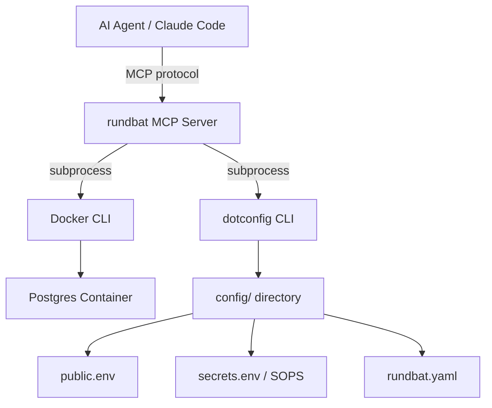
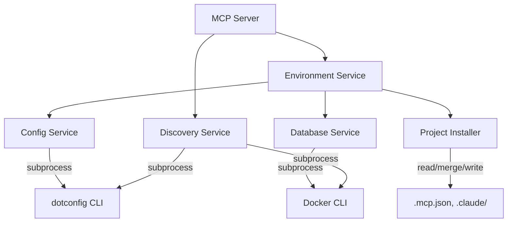
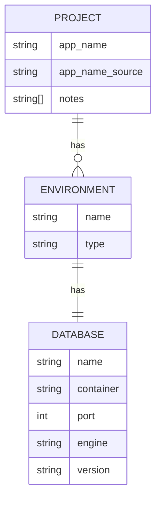

<!-- CLASI: Before changing code or making plans, review the SE process in CLAUDE.md -->

# Architecture

## Architecture Overview

rundbat is a Python MCP server that manages Docker-based local
development environments for Node/Postgres applications. It exposes
tools that AI agents call to discover the system, provision databases,
manage secrets, and retrieve connection strings.

The server is a single Python process. It shells out to `docker` for
container operations and `dotconfig` for configuration read/write. It
does not import either as a library.

## Technology Stack

- **Language**: Python 3.10+
- **MCP framework**: `mcp` Python SDK (FastMCP)
- **Distribution**: pipx-installable package with `pyproject.toml`
- **Container management**: Docker CLI via `subprocess`
- **Configuration**: dotconfig CLI via `subprocess`
- **Secret encryption**: SOPS (managed by dotconfig, transparent to rundbat)
- **Testing**: pytest, with Docker-dependent tests marked for conditional skip
- **Database**: PostgreSQL 16 (in Docker containers)

### Justification

- **Python**: Matches CLASI's pattern. pipx installation gives isolated
  environments. The team has Python expertise.
- **subprocess over SDK**: Docker SDK adds a heavy dependency and version
  coupling. The CLI is stable, well-documented, and available everywhere
  Docker is. Same reasoning for dotconfig.
- **FastMCP**: The standard Python MCP SDK. Minimal boilerplate for
  defining tools with typed parameters.

## Component Design

### Component: MCP Server

**Purpose**: Expose rundbat tools over the MCP protocol.

**Boundary**: Handles MCP connection lifecycle, tool registration, and
request routing. Does not contain business logic.

**Use Cases**: All (entry point for every tool call)

Implemented as a FastMCP server with tool decorators. Each tool function
validates inputs, delegates to the appropriate service module, and
returns structured results.

### Component: Discovery Service

**Purpose**: Detect host system capabilities and existing configuration.

**Boundary**: Reads system state (OS, Docker, dotconfig, Node). Does not
modify anything.

**Use Cases**: SUC-001

Runs shell commands (`docker info`, `dotconfig --version`, `node --version`)
and parses output. Returns a structured capabilities report.

Discovery checks for tool *presence* via version commands. It does not
perform configuration or container operations, so these calls are not
routed through Config Service or Database Service.

### Component: Config Service

**Purpose**: Manage rundbat configuration through dotconfig.

**Boundary**: All dotconfig subprocess calls live here. Other components
call this service, never dotconfig directly.

**Use Cases**: SUC-002, SUC-003, SUC-006, SUC-007

Wraps all dotconfig subprocess calls: loading config and secrets,
saving config and secrets, and initializing the project. Other
components call this service, never dotconfig directly.

### Component: Database Service

**Purpose**: Manage Postgres Docker containers for local environments.

**Boundary**: All Docker subprocess calls for database containers live
here. Handles container create, start, stop, health check, and port
allocation.

**Use Cases**: SUC-003, SUC-004, SUC-005

Wraps Docker CLI for container lifecycle. Key behavior: an
`ensure_running` operation implements stale state recovery — stopped
containers are restarted, missing containers are recreated from config
with a data-loss warning. Health checks use `docker exec pg_isready`
to confirm Postgres is accepting connections (not just port open).

### Component: Environment Service

**Purpose**: Orchestrate environment creation and config retrieval.

**Boundary**: Coordinates Config Service and Database Service. Implements
`create_environment` and `get_environment_config` workflows.

**Use Cases**: SUC-003, SUC-004, SUC-005

This is the main orchestration layer. `get_environment_config` loads
config, calls `ensure_running`, checks for drift, and assembles the
response.

### Component: Project Installer

**Purpose**: Install rundbat integration files into a target project.

**Boundary**: Reads and merges into existing project files. Never
overwrites — always loads the current file, merges the rundbat entries,
and writes back. Operates on the target project directory, not the
rundbat package itself.

**Use Cases**: SUC-002 (called during `init_project`)

Installs three things into the target project:

1. **`.mcp.json`** — Adds a `rundbat` entry to the `mcpServers` object.
   Reads the existing file first and merges, preserving other servers
   (e.g., CLASI). If the file does not exist, creates it.

2. **`.claude/rules/rundbat.md`** — A rule file that tells the model what
   rundbat does and when to use it. Covers: "If you need a database,
   connection string, or deployment environment, use the rundbat MCP
   tools." This ensures the model knows the tools exist even if the
   human doesn't mention them.

3. **`.claude/settings.json`** hooks — Adds a `UserPromptSubmit` hook
   that echoes a reminder: "If this task involves databases, deployment,
   or environment setup, use the rundbat MCP server." Reads the existing
   settings file and merges the hook into the existing hooks array,
   preserving other hooks (e.g., CLASI's SE process reminder).

The installer is called by `init_project` and is idempotent — running
it again updates entries if they've changed but does not duplicate them.

## Dependency Map

All arrows point downward — no circular dependencies. The MCP Server
layer depends on services; services depend on external CLIs or project
files.

## Data Model

rundbat's persistent state is minimal — it lives in `rundbat.yaml` files
managed by dotconfig.

There is no application database. All state is in YAML files under
dotconfig's `config/` directory. This means state is version-controlled,
encrypted where needed, and shared across team members.

## Security Considerations

- **Secrets**: All credentials (database passwords, connection strings)
  are stored in dotconfig's `secrets.env` files, encrypted by SOPS. rundbat
  never writes secrets to plain-text files or logs.
- **Generated passwords**: Database passwords are generated using Python's
  `secrets` module (cryptographically secure).
- **Subprocess calls**: All shell commands use `subprocess.run` with
  argument lists (not shell=True) to prevent injection.
- **No network exposure**: Local database containers bind to localhost only
  by default.

## Design Rationale

**CLI subprocess vs. SDK imports**: Both Docker and dotconfig are called
via subprocess rather than imported as libraries. This avoids version
coupling (Docker SDK versions must match the Docker daemon), keeps the
dependency tree small, and matches how a human would interact with these
tools. The cost is parsing CLI output, which is manageable for the
structured output both tools provide.

**Single `get_environment_config` entry point**: The spec emphasizes that
the most common interaction is an agent starting a session and needing a
connection string. Rather than requiring the agent to call health_check,
then start_database, then load config, a single tool does it all with
automatic recovery. This is the primary design goal of the sprint.

**Port auto-allocation**: When the default port (5432) is occupied,
rundbat increments until it finds an available port. This is stored in
`rundbat.yaml` so subsequent calls use the same port. Simple, predictable,
no port registry needed.

**Health check via pg_isready**: Health checks use
`docker exec <container> pg_isready` rather than a TCP connection probe.
This confirms Postgres is actually accepting connections, not just that
the port is open. It requires no additional Python dependencies.

**Error handling**: Subprocess failures (non-zero exit, timeout) are
caught by the calling service and returned as structured error objects
with the command, exit code, and stderr. The MCP Server layer does not
catch or transform service errors — it passes them through to the caller
as MCP error responses with actionable messages.

## Decisions

1. **dotconfig subprocess interface**: Confirmed via `dotconfig agent`.
   Key commands for the Config Service:
   - `dotconfig load -d <env> --stdout` — assemble layered .env to stdout
   - `dotconfig load -d <env> --file rundbat.yaml --stdout` — retrieve
     rundbat.yaml to stdout
   - `dotconfig save -d <env> --file rundbat.yaml` — store rundbat.yaml
   - Round-trip .env edits: `dotconfig load -d <env>` (writes .env),
     edit in place, `dotconfig save` (writes back with SOPS re-encryption)
   - `dotconfig init` — first-time setup of config directory and keys

2. **MCP server transport**: stdio, matching the CLASI pattern. Confirmed
   by stakeholder.

3. **Health check mechanism**: `docker exec <container> pg_isready`.
   Confirms Postgres is accepting connections, not just that the port is
   open. No additional Python dependencies required.

## Sprint Changes

### Changes Planned

This is the first sprint. All components are new:

- Python package scaffolding (`pyproject.toml`, `src/rundbat/`)
- MCP Server component with FastMCP tool registration
- Discovery Service (OS, Docker, dotconfig, Node detection)
- Config Service (dotconfig subprocess wrapper)
- Database Service (Docker container lifecycle)
- Environment Service (orchestration of create and get_config)
- Project Installer (`.mcp.json`, rules, hooks — merge into target project)
- Test suite with pytest fixtures for Docker-dependent tests

### Changed Components

| Component | Change | Notes |
|---|---|---|
| Package | Added | New Python package with pyproject.toml |
| MCP Server | Added | FastMCP server with all Sprint 001 tools |
| Discovery Service | Added | System capability detection |
| Config Service | Added | dotconfig subprocess wrapper |
| Database Service | Added | Docker container lifecycle management |
| Environment Service | Added | Orchestration layer |
| Project Installer | Added | Installs .mcp.json, rules, hooks into target project |

### Migration Concerns

None — this is a greenfield project.
