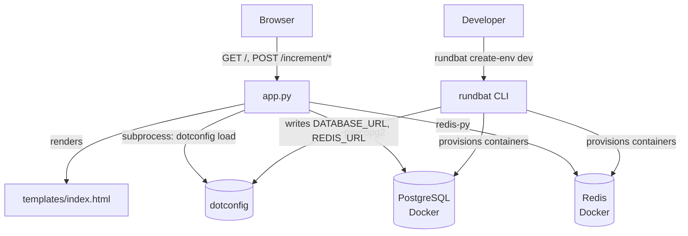
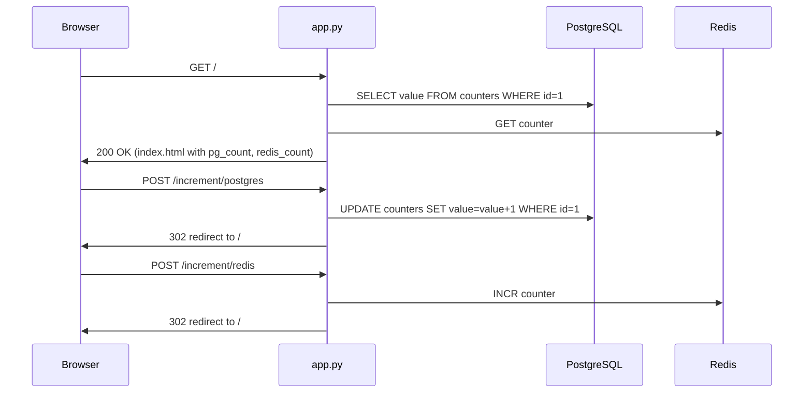
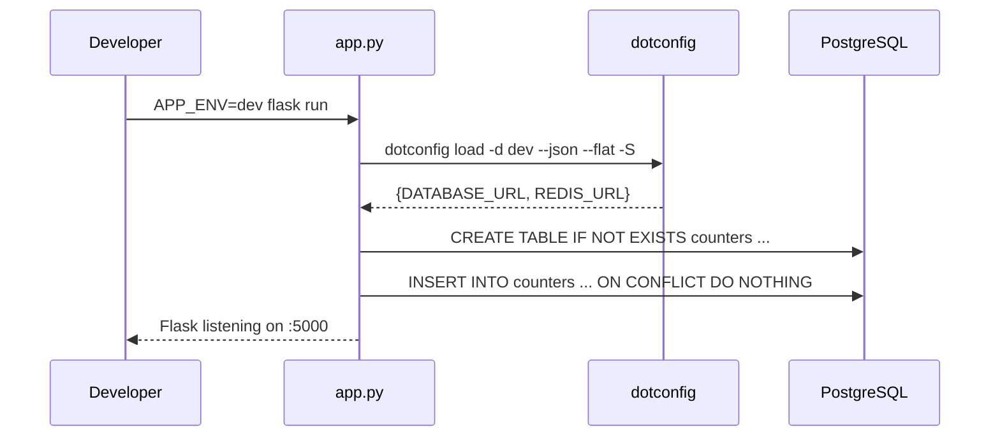

<!-- CLASI: Before changing code or making plans, review the SE process in CLAUDE.md -->

# Architecture Update — Sprint 001: Flask Counter App

## What Changed

This sprint introduces the entire Flask Counter App from scratch. There
is no prior codebase to update. The deliverables are:

- `app.py` — single-file Flask application
- `templates/index.html` — single Jinja2 template
- `requirements.txt` — Python dependency manifest
- Dev environment provisioned by rundbat (containers, dotconfig config)

---

## Step 1: Understand the Problem

The app must display and increment two independent counters — one in
PostgreSQL, one in Redis — through a standard browser form interface.
Configuration must flow entirely through dotconfig; no credentials may
be hardcoded. The dev environment uses rundbat to provision local Docker
containers for both databases.

The key design constraint (from the spec) is that the app is a single
Python file. No Flask blueprints, no application package, no ORM.

---

## Step 2: Responsibilities

Three distinct responsibilities:

1. **Configuration loading** — read `DATABASE_URL` and `REDIS_URL` from
   dotconfig at startup. Runs once; result is stored in module-level
   variables.

2. **Database initialization** — create the `counters` table and seed row
   if absent (PostgreSQL); rely on Redis `INCR` semantics for key creation.
   Runs at startup (PostgreSQL) and lazily on first access (Redis).

3. **Request handling** — serve `GET /`, `POST /increment/postgres`, and
   `POST /increment/redis`. Each handler reads or writes exactly one
   backend and either renders a template or redirects.

These three responsibilities are cohesive within a single file because
they all change for the same reason: the app's counter behavior.

---

## Step 3: Modules

### Module: `app.py`

**Purpose:** Serve the Flask counter application — load config, initialize
schemas, and handle HTTP requests.

**Boundary:**
- Inside: route definitions, config loading, db init logic, psycopg2
  and redis-py calls.
- Outside: Docker container management (rundbat), config storage
  (dotconfig), HTTP transport (Flask/Werkzeug internals).

**Use cases served:** SUC-001, SUC-002, SUC-003, SUC-005, SUC-006.

### Module: `templates/index.html`

**Purpose:** Render the single counter page with two counter values and
two POST form buttons.

**Boundary:**
- Inside: HTML markup, Jinja2 template variables (`pg_count`, `redis_count`).
- Outside: CSS styling (none required), JavaScript (none used).

**Use cases served:** SUC-001.

### External: rundbat (CLI tool)

**Purpose:** Provision PostgreSQL and Redis Docker containers and write
connection strings to dotconfig for the dev environment.

**Boundary:**
- The app never calls rundbat directly. rundbat is invoked by the developer
  before starting Flask.

**Use cases served:** SUC-004.

### External: dotconfig (CLI tool)

**Purpose:** Provide encrypted configuration (DATABASE_URL, REDIS_URL) to
the Flask app at startup.

**Boundary:**
- The app calls `dotconfig load -d <ENV> --json --flat -S` via subprocess
  once at startup and caches the result. The app never reads `config/`
  files directly.

**Use cases served:** SUC-001, SUC-002, SUC-003, SUC-004, SUC-005, SUC-006.

---

## Step 4: Diagrams

### Component Diagram

### Request Flow Diagram

### Startup Sequence

---

## Step 5: Complete Document

### What Changed

This sprint introduces the complete application from scratch:

| Artifact | Type | Purpose |
|---|---|---|
| `app.py` | New | Flask application — config, db init, routes |
| `templates/index.html` | New | Single-page counter UI |
| `requirements.txt` | New | Flask, psycopg2-binary, redis |

No existing components are modified because there are none.

### Why

This is the first sprint of the project. The goal is a working reference
implementation of the rundbat + dotconfig workflow for dev environments.

### Impact on Existing Components

None — this is a greenfield project.

### Migration Concerns

None — no prior data model or deployment exists.

---

## Step 6: Design Rationale

### Decision: Single-file Flask application

**Context:** The spec mandates `NFR-001`: the app shall be a single Python
file.

**Alternatives considered:**
- Flask application package with blueprints and separate modules.

**Why this choice:** The project is a minimal reference implementation, not
a production application. A single file is easier to read, share, and
understand as a rundbat demonstration. Complexity is not warranted.

**Consequences:** All logic (config, db init, routes) lives in `app.py`.
This is acceptable because the file will remain small (under ~100 lines).

---

### Decision: Config loaded via subprocess to dotconfig

**Context:** The app needs `DATABASE_URL` and `REDIS_URL` from dotconfig.

**Alternatives considered:**
- Read `config/` files directly (violates `NFR-003` and the dotconfig
  contract; bypasses SOPS decryption).
- Use a dotconfig Python library (none exists in this stack).
- Inject vars as environment variables from a shell wrapper script.

**Why this choice:** Calling `dotconfig load` via subprocess is the
canonical approach in this project. It decrypts SOPS secrets, returns a
flat JSON object, and keeps the app decoupled from dotconfig internals.
The call happens once at startup; there is no per-request overhead.

**Consequences:** The app has a subprocess dependency on dotconfig being
installed. If dotconfig is absent, the app fails at startup with a clear
error. This is acceptable because the project's deployment model requires
dotconfig.

---

### Decision: PostgreSQL schema initialized at startup, Redis lazily

**Context:** The spec (UC-005, UC-006) describes two initialization
behaviors.

**Alternatives considered:**
- Initialize both at startup.
- Initialize both lazily on first request.

**Why this choice:** PostgreSQL needs a table to exist before any SELECT
can run, so startup init prevents a failure on the very first request.
Redis `INCR` creates the key automatically if absent (starting from 0 then
returning 1), so lazy init is safe and requires no extra logic.

**Consequences:** Flask startup will fail if PostgreSQL is unreachable (the
error is clear and expected). Redis unreachability is detected on the first
request.

---

## Step 7: Open Questions

1. **`APP_ENV` default:** Should the app default to `dev` if `APP_ENV` is
   unset, or should it fail loudly? The spec says "defaults to `dev`"
   (section 1.3). Defaulting to `dev` is safe for this sprint.

2. **Error page behavior:** The spec mentions 500 error pages for
   unreachable backends (UC-001 E1, E2). Should these be Flask's default
   error page or a custom template? For sprint 001, the default Flask error
   page is acceptable.

3. **dotconfig subprocess timeout:** If dotconfig hangs, the Flask process
   hangs at startup. A subprocess timeout (e.g., 10 seconds) would improve
   robustness but adds complexity. Deferred to a future sprint.

---

## Architecture Review

**Verdict: APPROVE**

**Consistency:** The Sprint Changes section matches the document body. All
three use-case groups (config loading, db init, request handling) map to
clearly identified responsibilities and are covered by at least one use case.

**Codebase Alignment:** This is a greenfield sprint; there is no existing
code to drift from.

**Design Quality:**
- `app.py` passes the cohesion test: one sentence, one concern ("Serve the
  Flask counter application").
- No circular dependencies. The dependency graph flows
  Browser → app.py → {PostgreSQL, Redis, dotconfig} with no cycles.
- Fan-out from `app.py` is 3 (dotconfig, PostgreSQL, Redis), well within
  the limit.

**Anti-Patterns:** None detected. The single-file constraint is a deliberate
design choice, not a god-component anti-pattern — the file is small and its
responsibilities are cohesive.

**Risks:**
- Subprocess call to dotconfig at startup is a mild operational risk (if
  dotconfig is not installed). Mitigated by clear error messaging.
- No data migration risk (greenfield).
